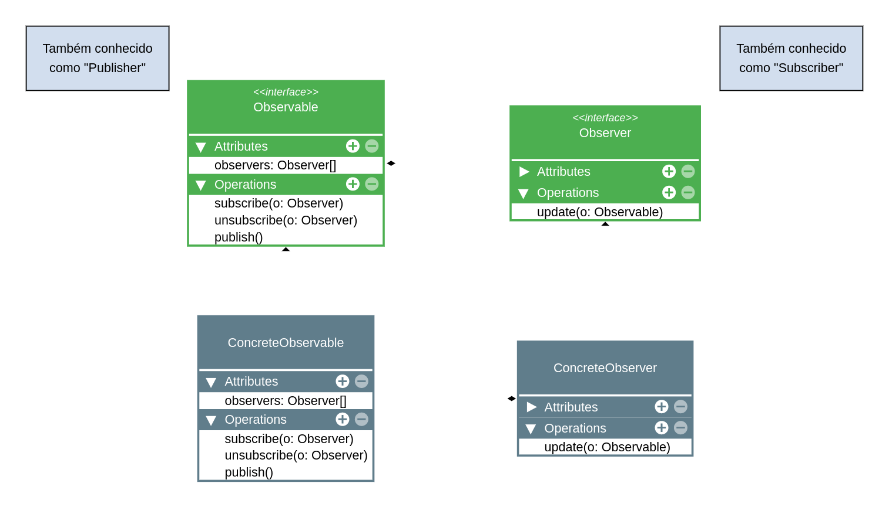

# Observer - Behavioural (Comportamental)

## Intenção

_Define uma dependência um para muitos entre objetos, de modo que, quando um objeto muda de estado, todos os seus dependentes são automaticamente notificados e atualizados._

---

## Sobre o Observer

Em vídeo: https://www.youtube.com/watch?v=iMV1aHaijhQ&list=PLbIBj8vQhvm0VY5YrMrafWaQY2EnJ3j8H&index=41

---

## Estrutura

Veja a pasta diagramas.

## Aplicabilidade

Use o Observer quando:

- Precisa notificar vários objetos sobre a mudança de estado de outro(s) objeto(s).

## Implementação

## Consequências

O que é bom ou ruim no Observer:

**Bom:**

- Usa o SRP e OCP;
- Facilita a comunicação entre objetos em tempo de execução.

**Ruim:**

- Pode ser complexo ou impossível manter a ordem em que as notificações são enviadas.
