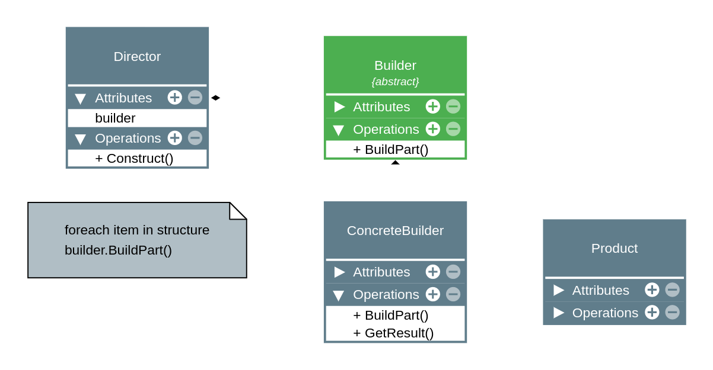

# Builder - Creational (Criação)

## Intenção

_Separar a construção de um objeto complexo da sua representação de modo que o mesmo processo de construção possa criar diferentes representações._

---

## Destilando a intenção

Em vídeo: https://www.youtube.com/watch?v=2VwLvwsIu-8&list=PLbIBj8vQhvm0VY5YrMrafWaQY2EnJ3j8H&index=6

A intenção acima significa que:

- O padrão sugere a separação do código que cria e o código que usa o objeto;
- Trata da criação de objetos complexos (complexos de verdade), como:
  - Objetos com construtores muito complexos;
  - Objetos compostos de vários objetos (composite);
  - Objetos com algoritmo de criação complexo.

Além disso, o padrão também:

- Permite a criação de um objeto em etapas;
- Permite method chaining (encadeamento de métodos);
- Permite que o objeto final varie em dados e tipo.

---

## Implementação

Veja o código dessa mesma pasta.

## Estrutura

## Aplicabilidade

Use o Builder quando:

- A criação do objeto se torna complexa;
- Quiser que o código seja capaz de gerar diferentes representações do mesmo objeto.

## Consequências

O que é bom ou ruim no Builder:

**Bom:**

- Separa criação de utilização de objetos;
- O cliente não precisa criar objetos diretamente;
- O mesmo código pode construir objetos diferentes;
- Ajuda na aplicação dos princípios SRP e OCP.

**Ruim:**

- O código final pode se tornar muito complexo.
